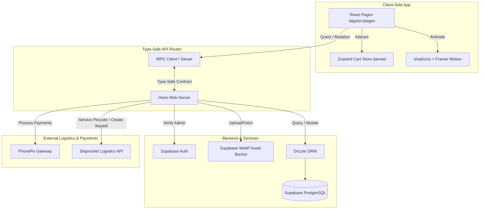

# Roots & Leaves — Natural Hair Care & Wellness
## Cinematic & Luxury Editorial E-Commerce Platform

Welcome to the comprehensive system documentation for **Roots & Leaves** (also known as **Sishika Vlogs**). This project is a state-of-the-art, high-end, Ayurvedic-inspired fullstack e-commerce and logistics platform designed for an elite, immersive customer experience.

This documentation serves as a complete blueprint. It outlines the design aesthetics, technology stack, directory structure, page-by-page functionality, administrative dispatch operations, and state mechanics so that any developer or AI model can instantly understand, visualize, and maintain this codebase.

---

## 🗺️ Architectural Ecosystem

Below is a conceptual visualization of the Roots & Leaves architecture, showcasing the flow of type-safe tRPC client queries, state management, and third-party logistics integrations.



---

## 🎨 Visual & Design System

The visual identity of Roots & Leaves is grounded in **cinematic storytelling** and the raw, earthy textures of Ayurveda. It utilizes a custom "Sandalwood Editorial" aesthetic to project wealth, tradition, and luxury.

### 🎨 Harmonious Color Palette
All styles are systematically bound to the brand's core design tokens:
*   🌸 **Alabaster/Sandalwood Sand (`#FAF9F6`)**: The dominant background. Warm, off-white, resembling handmade parchment paper.
*   🪵 **Deep Sandalwood Wood (`#2D241A`)**: Used for high-contrast cards, primary text, and rich, royal backgrounds.
*   ✨ **Antique Gold (`#E5C492`)**: Used for borders, badges, dividers, and premium typographic highlights.
*   🍂 **Warm Bronze (`#B37943`)**: Accents, labels, and micro-branding highlights.
*   🔴 **YouTube Red (`#FF0000`) & 📸 Instagram Sunset**: Utilized carefully on social badges inside unified gold-accented containers to preserve brand identity without clashing with the luxury color scheme.

### 📐 Structural Layout & Ornaments
*   **The PageWrapper System (`PageWrapper.tsx`)**: Consolidates the layout structure across all user-facing routes. It layers a subtle, non-repeating sand-textured background, controls responsive layout padding, and keeps the scrolling container visually clean.
*   **Architectural Jaali Side Borders**: Repeating vertical patterns of classical Indian lattices (Jaali) align the left and right screen edges, staying locked behind the navigation overlay to add depth and an architectural frame.
*   **Floating Botanicals (`FloatingBotanicals.tsx`)**: Scroll-linked, floating leaf and flower SVGs drift organically in the background, responding to user scrolling speeds with delicate parallax movements to simulate the essence of natural ingredients.
*   **Section Dividers (`SectionDivider.tsx`)**: Antique gold floral vectors dividing landing elements gracefully, replacing hard lines with organic luxury accents.

---

## 🛠️ Complete Technology Stack

| Layer | Technology / Library | Role & Implementation |
| :--- | :--- | :--- |
| **Framework** | **Next.js 16 (React 19)** | High-performance server-rendered framework leveraging **App Router** for fast routing and layout consistency. |
| **Styling** | **Tailwind CSS & Vanilla CSS** | Custom styling rules defined dynamically in `src/index.css` paired with Tailwind utility classes for absolute layout responsiveness. |
| **Animations** | **Framer Motion 12** | Choreographs entry fades, floating paralaxes, hover scale springs, side-sheet sliding, and micro-interactions. |
| **Touch Carousels** | **Swiper 12** | Powers the mobile/tablet touch carousels with smooth progress loaders and touch-inertia. |
| **State** | **Zustand 5** | Manages the global reactive shopping cart state, persisted automatically via `localstorage` middleware. |
| **API** | **Hono + tRPC 11** | End-to-end type-safe contract validation ensuring frontend components match server models without compile-time runtime risks. |
| **Database** | **Supabase (PostgreSQL)** | Persistent relational database storing customer profiles, product metrics, variants, order items, and dispatch logs. |
| **ORM** | **Drizzle ORM** | Schema declarations and type-safe query building for the SQL layer. |
| **Logistics** | **Shiprocket API** | Automated tracking timelines, pincode serviceability checks, delivery cost calculation, waybill generation, and label PDFs. |
| **Payments** | **PhonePe Gateway** | Secure, deep UPI integration handling callback events to securely mark transactions as Paid. |
| **Auth & Media** | **Supabase Auth & Storage** | Admin panel security shielding and compression buckets optimized for serving fast WebP graphics. |

---

## 📁 Repository Blueprint

```
/RootsAndLeaves/
├── app/
│   ├── src/
│   │   ├── app/                      # Next.js App Router (Routing Tree)
│   │   │   ├── layout.tsx            # Global providers, fonts, and script loaders
│   │   │   ├── page.tsx              # Storefront Root Page (Mounts pages/Home)
│   │   │   ├── shop/                 # Shop route wrapper
│   │   │   ├── product/              # Dynamic product detail routing
│   │   │   ├── checkout/             # Multi-step checkout route
│   │   │   ├── track/                # Order tracking directory
│   │   │   ├── admin/                # Admin portal routes
│   │   │   └── ...                   # Brand policies (terms, returns, shipping)
│   │   ├── pages/                    # Componentized Page Templates
│   │   │   ├── Home.tsx              # Cinematic homepage layout
│   │   │   ├── Shop.tsx              # Searchable, categorizable catalog
│   │   │   ├── ProductDetail.tsx     # Dynamic variant/accordion showcase
│   │   │   ├── Checkout.tsx          # Pincode check, COD/PhonePe gateways
│   │   │   ├── TrackOrder.tsx        # Shipment progress timeline
│   │   │   └── ...
│   │   ├── admin/                    # Operations Dashboard Directory
│   │   │   ├── AdminLayout.tsx       # Sidebar, layout wrapper, state guards
│   │   │   ├── AdminLogin.tsx        # Supabase authentication terminal
│   │   │   ├── AdminDashboard.tsx    # General KPIs, orders snapshot, fast actions
│   │   │   ├── AdminAnalytics.tsx    # Sales trend charts, graphs, top items
│   │   │   ├── AdminProducts.tsx     # Variant/SKU managers, WebP image compressors
│   │   │   ├── AdminOrders.tsx       # Live status update panel, manual fulfillment
│   │   │   └── AdminPacking.tsx      # Combined packing listing aggregated by SKU
│   │   ├── components/               # High-Performance Shared Components
│   │   │   ├── PageWrapper.tsx       # Layout background, scrolling, jaali strips
│   │   │   ├── Navbar.tsx            # Header, transparent-to-cream scroll transitions
│   │   │   ├── Footer.tsx            # Mobile responsive accordion links & site meta
│   │   │   ├── CartDrawer.tsx        # Sliding Cart panel with threshold tracking
│   │   │   ├── ProductCard.tsx       # Reusable, gold-hover-glowing visual cards
│   │   │   ├── RitualStories.tsx     # YouTube Shorts horizontal video loop ref
│   │   │   ├── FloatingBotanicals.tsx# Parallax drifting leaf patterns
│   │   │   └── ui/                   # Modular shadcn UI widgets (Dropdowns, Cards)
│   │   ├── lib/                      # Utilities & Shared Helpers
│   │   │   ├── store.ts              # Zustand local-storage cart state
│   │   │   ├── supabase.ts           # Supabase client singleton
│   │   │   └── utils.ts              # Tailwind merger helper
│   │   ├── providers/                # Provider bindings (tRPC Query context)
│   │   └── index.css                 # Master typography, styling tokens, custom rules
│   ├── api/                          # Hono backend endpoints
│   │   ├── routers/                  # tRPC micro-routers (payments, logistics)
│   │   ├── router.ts                 # API aggregation point
│   │   └── boot.ts                   # Core startup scripts
│   ├── db/                           # Drizzle mappings & migrations
│   └── supabase-schema.sql           # Database schema & RLS policies
```

---

## 🛍️ Storefront Page-by-Page Breakdown

Every storefront page in Roots & Leaves is carefully designed as a modular React component, sharing global styles, header states, and cart drawers.

---

### 1. Home Page (`pages/Home.tsx`)
The entry point of the site, presenting the customer with immediate brand heritage and visual prestige.

*   **Hero Section**: High-resolution cinematic background sliders featuring key products, paired with gold-accented headers and serif call-to-actions ("Explore the Collection").
*   **Drifting Botanicals**: Parallax-linked botanical assets float gently over content sections as the user scrolls.
*   **Brand Story Highlight**: An editorial typography layout explaining the founder's mission, values, and devotion to 100% natural, handcrafted remedies.
*   **Trust Badges**: Elegant visual badges indicating "Cruelty Free," "100% Chemical Free," and "Eco-conscious Sourcing."
*   **Featured Collections**: Carousel highlighting premium best-sellers with gold-glowing borders upon mouse hover.
*   **Ritual Stories Video Loop**: Embeds 5 specific short YouTube videos in a 5-column grid (desktop) or interactive Swiper slide (mobile/tablet).

---

### 2. Shop Page (`pages/Shop.tsx`)
A high-efficiency editorial catalog that allows users to seamlessly discover and filter products.

*   **Category Filtering Tabs**: Easy category switching (All, Foods, Naturals) that filters product grids instantly via state transitions.
*   **Responsive Product Grid**: Highly detailed cards (`ProductCard.tsx`) displaying product names, rating reviews, prices, and sizes.
*   **Search Engine Bar**: Live text-search filtering that matches input terms against product tags, descriptions, and names.
*   **Empty Search Placeholder**: A beautiful fallback element that suggests alternatives when search queries yield zero results.

---

### 3. Product Detail Page (`pages/ProductDetail.tsx`)
A dynamic showcase dedicated to highlighting specific items and closing sales conversions.

*   **Multi-Image Gallery Carousel**: Pinch-to-zoom on mobile or drag-to-browse on desktop showing professional item textures.
*   **Dynamic Variant Selector**: Segmented controls (e.g. 200ml, 500ml or 100g, 250g) where select states instantly update SKU references and pricing tags in real-time.
*   **Interactive Quantity Adjustment**: Counters with max-stock limits preventing excess cart additions.
*   **Editorial Accordion Drawer (`ui/accordion.tsx`)**: Premium sections expanding to reveal:
    1.  *Description*: Brand narrative for the item.
    2.  *Ingredients*: Pure botanical compositions.
    3.  *How to Use*: Ayurvedic application instructions.
    4.  *Storage Rules*: Keeping natural formulations fresh.
*   **Smart Add to Cart Action**: Slide-sheet trigger animating items straight into the customer's cart.

---

### 4. Slide-Out Cart Drawer (`components/CartDrawer.tsx`)
A global, interactive cart overlay that can be opened from any storefront page.

*   **Glassmorphic Overlay Backdrop**: Dark blurred filter separating screen focus.
*   **Adding/Modifying Controls**: Customers can adjust quantities, delete items, or instantly see total item counts.
*   **Progressive Free Delivery Indicator**: Shows how close the user is to earning free shipping (e.g., "Add $50 more for Free Delivery!") accompanied by a glowing golden progress bar (`ui/progress.tsx`).
*   **Automatic Weight Engine**: Translates package unit tags (e.g., "500ml", "1kg") into total shipment weight in grams dynamically, assisting logistics cost calculators on checkout.
*   **Promotional Coupon Form**: Validates discount keys on the fly, immediately recalculating the final checkout price.

---

### 5. Checkout Page (`pages/Checkout.tsx`)
A friction-free checkout experience that guides the user through address details and payment.

*   **Pincode Serviceability Lookup**: Queries the Shiprocket API automatically as the user types their postal code, resolving city/state coordinates and warning if the region is unserviceable.
*   **Dynamic Shipping Cost Engine**: Communicates package weight parameters directly to the Shiprocket router, computing real-time delivery fees based on destination zoning.
*   **PhonePe Secure Payment Gateway**: Directly initializes a secure PhonePe UPI transaction, generating QR scanners on desktop and redirecting mobile users straight to their preferred banking apps (GPay, PhonePe).
*   **Cash on Delivery (COD) Fallback**: Configurable COD option with customizable cod fee adjustments.

---

### 6. Track Order Page (`pages/TrackOrder.tsx`)
A transparent tracking portal ensuring customers stay updated on shipping progress.

*   **Dual Search Parameters**: Customers can look up order states using either their unique **Order Number** or **Registered Mobile Phone**.
*   **Interactive Delivery Timeline**: Visually traces four standard checkpoints:
    1.  `Pending`: Order registered, pending validation.
    2.  `Paid`: Payments verified and cleared.
    3.  `Shipped`: Packaged items handed to logistics carriers.
    4.  `Delivered`: Package arrived safely at destination.
*   **Logistics Details Card**: Generates clickable waybill URLs linked directly to Shiprocket courier tracking engines.

---

### 7. Core Brand & Policy Pages
Handcrafted pages styled with the identical premium theme to maintain branding continuity.

*   **About Page (`pages/About.tsx`)**: An interactive editorial timeline mapping the origins of "Roots & Leaves," botanical sourcing philosophies, and founder stories.
*   **Contact Page (`pages/Contact.tsx`)**: Includes business hours, support email cards, a contact form, and an embedded map iframe showing store locations.
*   **Policy Folders (Privacy, Shipping, Terms, Returns)**: Stylized legal copy framed inside elegant scroll-locked glass containers, making reading legal documents feel premium.

---

## 🛠️ The Admin Dashboard System (`app/src/admin`)

The operational control center for the site, fully protected behind Supabase Auth guards.

```
┌────────────────────────────────────────────────────────┐
│  [Roots & Leaves Admin Portal]                        │
├────────────────────────────────────────────────────────┤
│  [KPIs] $14,200 Sales | 12 Pending | 148 Shipped       │
│                                                        │
│  ┌───────────────────────┐   ┌──────────────────────┐  │
│  │   Analytics & Charts  │   │  SKU/Product Manager │  │
│  │   [Recharts Sales]    │   │  [+ Add New Product] │  │
│  └───────────────────────┘   └──────────────────────┘  │
│  ┌───────────────────────┐   ┌──────────────────────┐  │
│  │   Order Fulfilment    │   │ Aggregated Packing   │  │
│  │   [Generate Waybill]  │   │   14x Hair Oil 250ml │  │
│  └───────────────────────┘   └──────────────────────┘  │
└────────────────────────────────────────────────────────┘
```

### 🔐 1. Authentication Hub (`AdminLogin.tsx`)
*   Secured by **Supabase Authentication**.
*   Restricts panel access strictly to users holding the administrative role.
*   Automated route guards immediately redirect unauthorized users back to the storefront home page.

### 📊 2. Main Dashboard & Analytics (`AdminDashboard.tsx`, `AdminAnalytics.tsx`)
*   **Performance Metrics (KPIs)**: Instantly tracks total sales volume (INR), total processed orders, average order value, and items sold.
*   **Interactive Recharts Graphs**:
    *   *Sales Charts*: Renders sales volume over customized dates.
    *   *Order Analytics*: Interactive bar charts plotting daily order volume.
    *   *Product Breakdown*: Visual pie charts mapping top-performing product categories.

### 📦 3. SKU & Product CRUD Manager (`AdminProducts.tsx`)
*   **Products Editor**: Complete interface for creating, editing, and deleting products.
*   **Variant Registry**: Add and map size variants, modify individual pricing structures, and record exact stock inventory limits.
*   **WebP Image Compressing Uploader**: Drag-and-drop media upload which automatically compresses images into fast-loading WebP assets under 2MB, saving Supabase bandwidth and optimizing storefront load times.

### 🚚 4. Shipping Operations & Logistics (`AdminOrders.tsx`, `AdminPacking.tsx`)
The operational powerhouse of the business, integrating directly with **Shiprocket** workflows.

*   **Aggregated Packing List (`AdminPacking.tsx`)**: An extremely practical view that groups all pending orders by product and size (e.g. *14x Hair Vitalizing Oil 250ml*, *8x Herbal Conditioning Wash 100g*), allowing warehouse staff to assemble inventory before packing individual shipments.
*   **Automated Shipment Generator**:
    1.  Admin opens a pending order card.
    2.  Clicking "Fulfill" sends details directly to the Shiprocket API.
    3.  Generates a unique **Shiprocket Waybill Tracking Number** in seconds.
    4.  Saves a printable shipping label PDF directly to the database.
*   **Partial Fulfillment Engine**: Allows shipping individual products from an order first if specific items are temporarily backordered.
*   **Courier Tracking URLs**: Automatically sends SMS/Email updates to customers with live tracking links and logs details under the order profile.

---

## 🎥 The Ritual Stories Cinematic Player

The landing page features a cinematic carousel of YouTube Shorts (`components/RitualStories.tsx`), designed with custom code to eliminate typical iframe bugs.

> [!IMPORTANT]
> **Technical IFrame Resolution**
> Ordinary embedded YouTube iframes trigger persistent cross-origin postMessage errors and race conditions in React when assigned dynamic IDs.
> This project resolves those issues by:
> 1. Passing direct React DOM references (`videoRef`) straight into the `window.YT.Player` constructor.
> 2. Hard-binding `origin: window.location.origin` and `enablejsapi: 1` to security variables to clear browser sandbox warnings.
> 3. Initializing players dynamically *only* when the parent section is actively scrolled into the browser viewport (`useInView`).
> 4. Destroying inactive player instances immediately on scroll-out or mouse-leave to save browser thread memory.

### 💎 "Royal & Rich" Social Links
Below the cinematic player sits the highly polished, unified social gateway:

1.  **Explore on Instagram**: Crafted in a high-prestige **Instagram Sunset Gradient** (`linear-gradient(45deg, #f09433 0%, #e6683c 25%, #dc2743 50%, #cc2366 75%, #bc1888 100%)`). On hover, a white illumination overlay shines across the button.
2.  **Join on YouTube**: A vibrant **YouTube Red (#FF0000)** container with soft shadows, scaling up slightly (`scale: 1.02`) on mouse focus.

Both buttons are locked to **identical dimensions** (height and width), use elegant editorial serif fonts, and automatically scale down to compact, touch-friendly round pills on mobile to merge seamlessly into the layout.

---

## ⚡ Core State & Business Logics

### The Zustand Persisted Cart (`lib/store.ts`)
The entire storefront cart state is orchestrated inside a reactive store containing advanced parsing algorithms:

```typescript
// Excerpt of the Zustand Cart engine parsing product sizes to calculate shipping weight
getTotalWeight: () =>
  get().items.reduce((sum, i) => {
    // Regex parsing weights like "250ml", "1kg", "500g"
    const weightMatch = i.variantLabel.match(/(\d+(?:\.\d+)?)\s*(g|kg|ml|l)/i)
    if (weightMatch) {
      let w = parseFloat(weightMatch[1])
      const unit = weightMatch[2].toLowerCase()
      if (unit === 'kg' || unit === 'l') w *= 1000 // Convert to grams
      return sum + w * i.quantity
    }
    return sum + 100 * i.quantity // Default fallback weight (100g)
  }, 0)
```

---

## 🚀 Future Integration & Scaling Notes

To scale the platform further, future developers or AI models can easily hook into these pre-configured integration points:

> [!TIP]
> *   **Marketing Automation**: Hook marketing pixels into the tRPC callback routes inside `api/routers/payment.ts` to trigger retargeting ads the moment a transaction successfully completes.
> *   **Warehouse Printing**: Link the `AdminPacking.tsx` endpoint to standard thermal receipt printers for printing packaging slips and labels on the fly.
> *   **CRM WhatsApp Integration**: Expand the `WhatsAppButton.tsx` logic to dynamically send order status notifications directly from the tRPC `order.updateStatus` backend route using official WhatsApp Business APIs.

---

*Handcrafted in devotion to natural wellness and high-performance engineering.*
*Roots & Leaves — Roots in tradition, crafted for you.*
